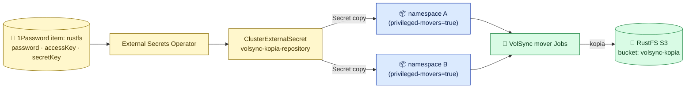

# Backup Repository Setup (S3 + Kopia)

The **one-time backend setup** behind the
[backup/restore system](storage-architecture.md): the S3 box, the bucket, the
credentials, and how they fan out to every namespace. You do this once; the
labels do everything after.

> **This cluster uses** [RustFS](https://github.com/rustfs/rustfs) (an
> S3-compatible object store) running off-cluster at `192.168.10.133:30292`.
> Any S3 works — MinIO, TrueNAS S3, Garage, Backblaze B2 — only the endpoint
> and credentials change.

## The credential flow



One credential, stored once, materialized automatically into every namespace
that opts in. Apps never carry S3 config.

## One-time setup steps

### 1. The S3 side — RustFS on TrueNAS

The S3 store must live **outside the cluster** — the whole point is that it
survives the cluster. Here it's [RustFS](https://github.com/rustfs/rustfs)
running as a **TrueNAS app** on the NAS (endpoint
`http://192.168.10.133:30292`, console on the same port).

1. Install the RustFS app on TrueNAS; its app/root credentials exist only
   for bootstrap and console administration — **never point Kubernetes at
   the root key.**
2. In the RustFS console, create the buckets:
   - `volsync-kopia` — the Kopia repository (this doc)
   - `postgres-backups` — CNPG/Barman database backups (separate system)
3. Create one **workload access key** (named `homelab-workload`) for all
   Kubernetes S3 clients, with its allow policy scoped to those buckets —
   exact IAM policy JSON and the root-vs-workload rationale:
   [RustFS credential runbook](domains/rustfs/credential-runbook.md).
4. **Register & verify the key works before you ever rely on it** — see
   hard-won lessons below.

### 2. The secret side (1Password → ESO)

One item, `rustfs`, in the `homelab-prod` vault (full field list incl. the
admin-only root keys: [credential runbook](domains/rustfs/credential-runbook.md)):

| Field | Used as |
|---|---|
| `kopia_password` | `KOPIA_PASSWORD` — encrypts every backup; **lose this, lose the backups** |
| `rustfs-workload-access-key` | `AWS_ACCESS_KEY_ID` |
| `rustfs-workload-secret-key` | `AWS_SECRET_ACCESS_KEY` |
| `root-access-key` / `root-secret-key` | TrueNAS app admin only — never used by workloads |

### 3. The fan-out (in Git, already done)

`clusters/talos/infra/volsync-backup-cluster/clusterexternalsecret.yaml`
renders the Secret every mover needs:

```yaml
# the Secret each namespace receives (volsync-kopia-repository)
KOPIA_REPOSITORY:     "s3://volsync-kopia/cluster"
KOPIA_S3_ENDPOINT:    "192.168.10.133:30292"
KOPIA_S3_BUCKET:      "volsync-kopia"
KOPIA_S3_DISABLE_TLS: "true"            # LAN-only traffic
KOPIA_PASSWORD:       <from 1Password>
AWS_ACCESS_KEY_ID:    <from 1Password>
AWS_SECRET_ACCESS_KEY: <from 1Password>
```

It targets every namespace labeled `volsync.backube/privileged-movers: "true"`
— the same label the [add-a-backup flow](storage-architecture.md#enable-a-backup)
puts on the namespace. Label the namespace, get the Secret. No per-app
credential plumbing, ever.

### 4. The fail-closed gate

`mutating-admission-policy.yaml` (same directory) injects a
`wait-for-rustfs` init container into every mover Job that TCP-probes
`192.168.10.133:30292` for up to 1h before any backup/restore runs. If you
move the S3 box, **update the probe address here and the endpoint in the
ClusterExternalSecret together.**

## Verifying the backend

```bash
# the Secret fans out to a gated namespace:
kubectl get secret volsync-kopia-repository -n <ns>

# the endpoint is reachable from the cluster (what the gate checks):
nc -zw5 192.168.10.133 30292 && echo OK

# kopia sees the repository (any completed mover proves auth end-to-end):
kubectl logs -n <ns> -l app.kubernetes.io/created-by=volsync --tail=20
```

## Hard-won lessons

- **Register the access key on the S3 server, then verify before any
  destructive rebuild.** A past full nuke proved an unregistered external
  credential blocks all recovery even with perfect Git state — the
  [DR pre-nuke checklist](disaster-recovery.md#pre-nuke-checklist) checks
  this for you.
- **The Kopia password is the single blast radius.** One shared repo, one
  password, every backup encrypted with it. Keep it only in 1Password;
  acceptable on a LAN, see
  [known limitations](storage-architecture.md#known-limitations-and-non-goals).
- **Rotation:** the per-step rotation procedure (new key on RustFS → update
  1Password → force ESO refresh → CNPG picks up automatically) lives in the
  [credential runbook](domains/rustfs/credential-runbook.md).
