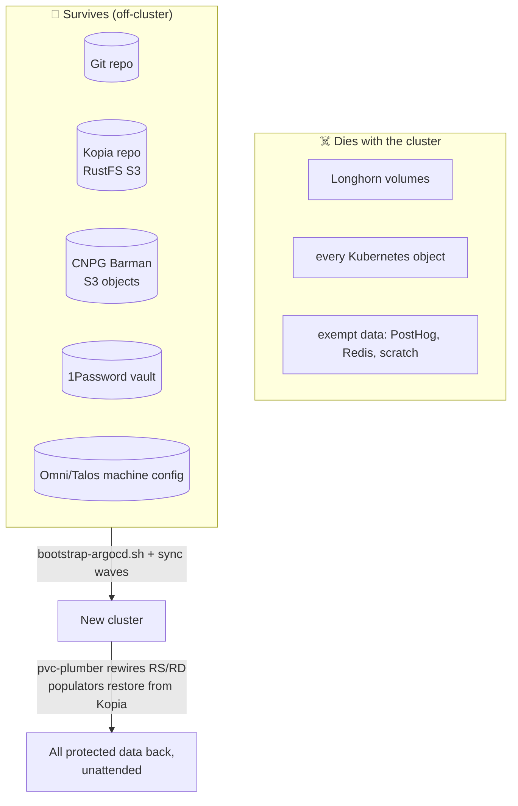
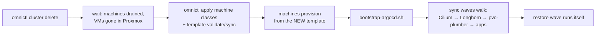

# Disaster Recovery

> The full-cluster destroy → rebuild → restore runbook, and the proof history
> behind it. Concepts + per-PVC operations live in
> [storage-architecture.md](storage-architecture.md). Databases recover via a
> **separate system** — [CNPG/Barman](domains/cnpg/disaster-recovery.md).

> [!CAUTION]
> The destructive steps require explicit operator intent. This documents the
> verified path; it is not an invitation to nuke during routine maintenance.

---

## The DR model in one diagram



Clusters are cattle. The Kopia repository, the Git repo, and the secrets
vault are the pets. Everything between them is reconstructed automatically.

## Proof history

| Date | Event | Result |
|---|---|---|
| 2026-06-02 | Planned full nuke (first acceptance) | **24/24 managed PVCs restored**, 24/24 post-restore backups Successful |
| 2026-06-12 | **Unplanned**: Longhorn V2 engine meltdown mid-rebuild | **25/25 restored** despite an instance-manager crash, a poisoned node, and a host reboot — the repo never lost a byte |
| 2026-06-13 | Planned rebuild onto Longhorn V1 | **24/24 restored unattended in ~75 minutes**, zero manual storage steps; operator at ~1m CPU; exemption contract honored |

Two full-cluster deaths inside 36 hours, one of them about as hostile as
storage failure gets — every protected volume came back both times.

> **The V2 footnote:** Longhorn's V2/SPDK engine was briefly tried and
> retired the same day — interrupted rebuilds under mass-restore load
> permanently corrupt replica metadata (open upstream bugs
> [#13315](https://github.com/longhorn/longhorn/issues/13315),
> [#13314](https://github.com/longhorn/longhorn/issues/13314)). The cluster
> runs V1, the upstream default. Don't revisit V2 without those fixed and a
> passed DR drill; full forensics in git history.

---

## Pre-nuke checklist

Block the nuke until every box checks — **you restore *from* these**:

- [ ] GitHub reachable; the rebuild revision **pushed** (ArgoCD pulls origin, not your working tree)
- [ ] GHCR image pulls work
- [ ] 1Password reachable; Connect token valid and recoverable off-cluster
- [ ] Cloudflare token valid and recoverable off-cluster
- [ ] RustFS/S3 endpoint reachable; access key registered on the external server; Kopia auth works
      (a past nuke proved an unregistered external credential blocks recovery even with perfect Git state)
- [ ] Talos secrets / Omni machine configs available off-cluster
- [ ] **Backups fresh**: every managed RS shows a recent `lastSyncTime` you can live with — apps roll back to exactly that moment
- [ ] **`/audit` clean** (live, not from memory): managed contract clean (`already-matches`, `would-*=0`, `write-gate-missing=0`, `stale=false`) **and** `needs-human-review=0`
- [ ] Restore canary green: recent `last-drill-result=pass`

## Rebuild sequence



**Ordering rule (twice-learned):** machine classes and the cluster template
are **snapshots inside Omni** — apply + sync them *before* machines
provision, or VMs are built from stale state and must be reprovisioned.

**Bootstrap rules** (proven by the 2026-06 rebuilds):

- CRDs first, controllers second, CRs third.
- Observability is **not** a core dependency — core apps must bootstrap
  without Prometheus; `kube-prometheus-stack` is the sole owner of
  `monitoring.coreos.com` CRDs.
- pvc-plumber lands at Wave 2 with the mover-gate MAP and the kopia
  credential fan-out; databases (Wave 4) and apps (Wave 6) follow.
- Replica rebuilds stay throttled to **1/node**
  (`clusters/talos/infra/longhorn/node-failure-settings.yaml`) — a mass
  restore saturates any engine on shared homelab hardware; do not raise it
  mid-bootstrap.

## What the restore wave looks like (calibrated expectations)

- All ReplicationDestinations appear within minutes of their namespaces; the
  operator stamps them from labels alone.
- Movers run with the injected `wait-for-rustfs` gate; restores complete in
  rough size order. The 2026-06-13 wave: 24/24 in ~45 minutes of wave time.
- **The API server will wobble.** etcd fsync latency inflates under
  cluster-wide restore I/O — expect intermittent `readyz` failures, slow
  kubectl, csi-sidecar leader-election restarts. It recovers between bursts;
  it is load, not failure.
- A few movers may hit cross-node attach conflicts ("volume is currently
  attached to a different node") as Jobs recreate pods — Longhorn's
  attachment reconciler clears these; the last stragglers land as load drains.
- Verdict signals that something is actually wrong: a mover Job in `Failed`,
  an RD with no `latestImage` long after its mover completed, or `/audit`
  showing `needs-human-review`.

## Post-restore acceptance

State BOTH claims, with live numbers:

1. **Managed restore contract**: every managed PVC `Bound` via populator,
   RS+RD `managed-by=pvc-plumber`, post-restore backups `Successful`,
   `already-matches=N/N`.
2. **Global audit hygiene**: `needs-human-review=0` across all PVCs —
   non-zero isn't a restore failure but it masks real problems (history: two
   exempt PVCs once sat unnoticed in review because acceptance only quoted
   the managed counters).

---

## The restore canary

Point-in-time acceptance rots; the canary keeps the proof fresh.

`manifests/apps/system/restore-canary/` + `scripts/restore-canary-drill.sh`
continuously re-run the real DR path against a dedicated test PVC:

```
sentinel (old UID + sha256) → forced backup → RD latestImage refresh
→ delete ONLY the canary PVC → Git/Argo recreate with dataSourceRef
→ populator restore → byte-identical verification
```

A passing drill proves the *entire* chain — Git render, operator wiring,
kopia round-trip, populator restore — with data integrity checked by hash,
never touching production PVCs. Results land as
`restore-canary.vanillax.dev/last-drill-*` annotations on the namespace.

What it does **not** prove: restores of backups older than its own, CNPG
recovery (separate system), or app-level data semantics — drill those
separately when they matter.

## Failure-mode catalog (from the 2026-06-12 incident)

Worked fixes for everything the hostile rebuild threw at us — stale CSI
attachments, read-only filesystems, wedged clone PVCs, finalizer-stuck
resources — live in the
[common failure modes table](storage-architecture.md#common-failure-modes).

