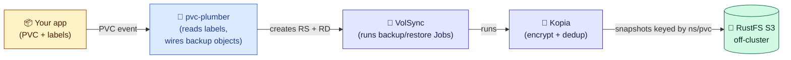
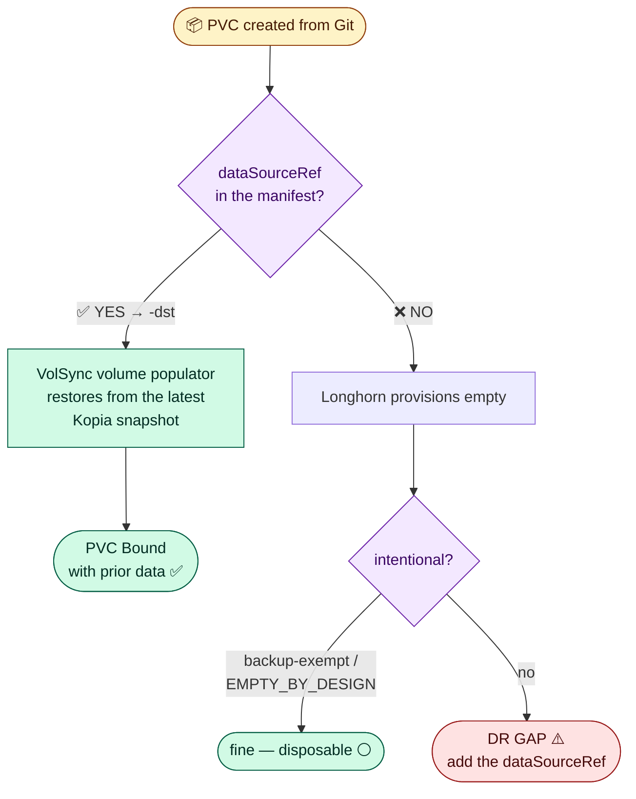
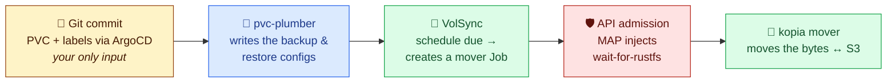
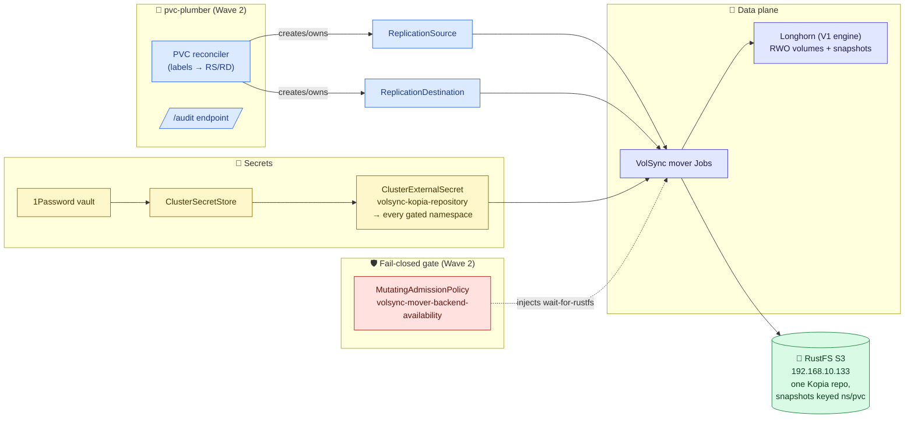
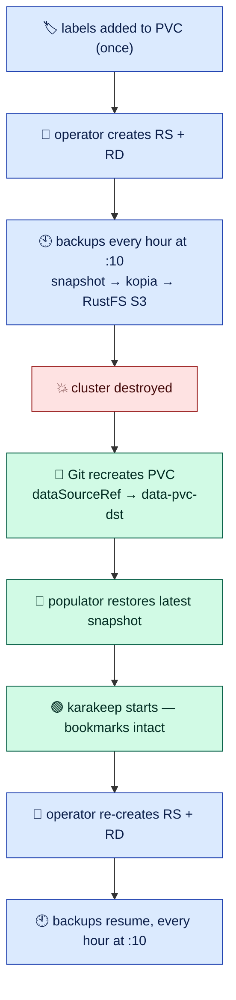
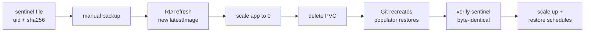

# Storage, Backup & Restore Architecture

The single source of truth for **how application data survives anything** in
this cluster — including the cluster itself ceasing to exist.

> **Scope:** application PVCs (Longhorn → VolSync/Kopia → RustFS S3).
> **Out of scope:** CloudNativePG database backups (Barman → S3).
> See [`cnpg disaster recovery`](domains/cnpg/disaster-recovery.md) — different
> tool, different runbook. The two systems never touch each other.

> **How to read this doc:** it gets more technical as you scroll. The first
> sections are plain English suitable for a whiteboard. The middle has the
> architecture diagrams and the operator's decision tree. The bottom is
> design rationale, portability notes, and honest limitations. Stop reading
> wherever the depth matches what you came for. This is the only doc you
> need; the [full-cluster rebuild runbook](disaster-recovery.md) is the one
> internal appendix.

> **Reading from another homelab?** This is internal documentation for one
> specific cluster, not a product. See
> [Adapting this to your cluster](#adapting-this-to-your-cluster) and
> [Known limitations](#known-limitations-and-non-goals) — the *pattern* is
> more portable than the specific stack.

---

## Quick start — yes, it's just labels

```yaml
metadata:
  labels:
    pvc-plumber.io/enabled: "true"          # ← back this volume up
    pvc-plumber.io/manage-volsync: "true"
    pvc-plumber.io/tier: "hourly"           # ← every hour
spec:
  dataSourceRef:                            # ← and restore it automatically
    apiGroup: volsync.backube               #    whenever it's recreated
    kind: ReplicationDestination
    name: <pvc-name>-dst
```

That's it. Backups run on schedule; delete the PVC (or the whole cluster)
and it comes back with its data. The rest of this page is why and how —
or **[🎮 play with the interactive simulator](simulator.html)** and nuke a
toy cluster yourself.
*(One-time backend prerequisite: an S3 box + one secret —
[backup repository setup](backup-repository-setup.md).)*

---

## Why this exists

**One sentence:** I can nuke the entire Kubernetes cluster, redeploy from
Git, and every app comes back with its data — no scripts, no manual restore
commands, no ordering choreography. It just happens.

That's the whole point. Per-PVC restore is just the mechanism; **cluster
rebuild is the use case.**

```mermaid
flowchart LR
    subgraph BEFORE["💥 Before: cluster died / I rebuilt it from scratch"]
      B1["🔥 Cluster: gone<br/>Apps: gone<br/>PVCs: gone"]
      B2["💾 RustFS S3: untouched<br/>(Kopia repo intact)"]
      B3["📂 Git: untouched"]
    end

    subgraph DURING["🔄 What I do"]
      D1["./scripts/bootstrap-argocd.sh"]
      D2["☕ wait"]
    end

    subgraph AFTER["✅ After"]
      A1["🟢 90 apps running"]
      A2["🟢 24/24 PVCs auto-restored<br/>from last backup"]
      A3["🟢 Backups already scheduled"]
    end

    BEFORE --> DURING --> AFTER

    classDef gone fill:#fee2e2,stroke:#991b1b,color:#450a0a;
    classDef kept fill:#d1fae5,stroke:#065f46,color:#022c22;
    classDef action fill:#fef3c7,stroke:#92400e,color:#451a03;
    classDef ok fill:#dbeafe,stroke:#1e40af,color:#0c1f4a;
    class B1 gone;
    class B2,B3 kept;
    class D1,D2 action;
    class A1,A2,A3 ok;
```



This is not a hypothesis. It has run for real **three times**:

| Date | Event | Result |
|---|---|---|
| 2026-06-02 | Planned full nuke (first acceptance) | 24/24 PVCs restored, 24/24 follow-up backups Successful |
| 2026-06-12 | **Unplanned** rebuild during a storage-engine meltdown | 25/25 restored through node crashes and a host reboot |
| 2026-06-13 | Planned rebuild onto a different storage engine | 24/24 restored **unattended in ~75 min**, zero manual steps |

**What I do NOT do during a cluster rebuild:**

- ❌ Run a restore script per app
- ❌ Remember which PVC needed which snapshot ID
- ❌ Worry about ordering — "restore Postgres before Immich starts"
- ❌ Manually mount storage, run kopia restore, fix permissions
- ❌ Worry about a backup firing against an unreachable repo and capturing
  an empty volume (a fail-closed admission gate on mover Jobs blocks that)

| Without this system | With this system |
|---|---|
| Per-app restore scripts in `scripts/restore-<app>.sh` | Three labels on the PVC |
| Remember snapshot IDs / dates / paths | The repo is keyed by `namespace/pvc` — the latest snapshot is found automatically |
| Restart order matters | Doesn't matter — every PVC gates itself on its own restore |
| Forget to restore one app → it boots empty, you notice in a week | The PVC's `dataSourceRef` restores it before the app can start |
| Cluster rebuild = day-long project | Cluster rebuild ≈ bootstrap + ~45 min of restore wave |

Day-zero install and day-N disaster recovery are **the same code path** —
the only difference is whether the repo has a snapshot for that PVC or not.

---

## In plain English

Apps store their state in PVCs (persistent disks). Disks fail, clusters get
rebuilt, mistakes get made — so every PVC needs a backup somewhere safe, and
on rebuild the PVC needs to come back with its data already in it.

We solved that with **labels** on the PVC. The system does the rest.

- Add three `pvc-plumber.io/*` labels to a PVC (and one gate label to its
  namespace).
- A backup runs on schedule — encrypted, deduplicated, stored on an
  **off-cluster** S3 box.
- If you ever delete the PVC and recreate it (same cluster, new cluster,
  doesn't matter), it comes back **already populated** from the most recent
  backup. No manual restore step.
- If the backup server is unreachable at backup time, the backup Job
  **refuses to run** rather than risk writing garbage. Empty backups over
  real data is the catastrophe we will never accept.

The entire system, as four if/else statements:

```text
when a PVC is created (first install, rebuild, or "oops"):
    if a backup exists for it          →  restore it, then start the app
    else                               →  start empty, begin backing it up

when a backup is due:
    if the backup server is reachable  →  snapshot → encrypt → dedup → store
    else                               →  refuse and retry later (never write garbage)

when a PVC is labeled backup-exempt:
    skip it forever, on purpose, with a written reason

when anything is ambiguous:
    do nothing and flag a human
```

The pieces in plain English:

- **Longhorn** — gives PVCs that can be snapshotted.
- **pvc-plumber** — the Go operator that reads the labels and creates the
  backup/restore objects. It never touches your data.
- **VolSync** — schedules the backup/restore Jobs that run a tool called
  Kopia. It works from two instruction objects per volume:
  a **ReplicationSource (RS)** — "back this up on this schedule" — and a
  **ReplicationDestination (RD)** — "here's how to restore it."
  Mnemonic: **D for Disaster recovery** — the RD is what saves you.
- **Kopia** — encrypts, dedupes, and writes to S3 on RustFS.
- **1Password + External Secrets** — delivers the repo password to every
  namespace that needs it.

If that's all you wanted, you can stop here.

---

## The picture, simply

**Who does what.** Each piece only knows about its neighbours.



**What happens when a PVC is (re)created.** The whole story in one diagram:



> 🔑 **The single most important rule in this whole system:** a PVC with no
> `dataSourceRef` recreates **EMPTY**. The backup still exists in Kopia —
> but nothing tells Kubernetes to restore it. Git must carry the
> `dataSourceRef` for a volume to be DR-complete. The operator's `/audit`
> endpoint and a CI check both watch for this gap.

**The handoff chain — who triggers whom.** The same five-stage relay runs
for every backup, and (via the ReplicationDestination) every restore:



The Git commit is the only thing a human touches — every arrow after it is
automatic. ([Watch it run, one click at a time, in the simulator.](simulator.html))

---

## If this, then that

The whole behaviour as a flat lookup table:

| You do this | What happens |
|---|---|
| Add the fuse labels + `dataSourceRef` to a PVC (namespace already gated) | Operator creates `ReplicationSource` (the schedule) + `ReplicationDestination` (the restore capability). Backups run on the tier's cadence. |
| Recreate that PVC — same cluster or a brand-new one | VolSync's populator restores it from the latest snapshot **before the app starts**. No human action. |
| Delete the app from Git, re-add it next month | Same as above. Your "oops" undoes itself. |
| Whole cluster gets nuked | Every labeled PVC auto-restores during bootstrap, in parallel. Three-for-three so far. |
| Label a PVC `backup-exempt: "true"` + a reason annotation | Operator deliberately skips it and records `skipped-exempt` in `/audit`. Recreates empty, **by recorded decision**. |
| Use the bare `backup-exempt-reason` key instead of the fully-qualified one | CI fails the PR. (The bare key is silently ignored at runtime — invisible until DR. We learned this the hard way.) |
| Remove the fuse labels | Operator garbage-collects its RS/RD. Snapshots already in the repo are kept. **Remove the `dataSourceRef` too** — a dangling one deadlocks the recreated PVC `Pending` forever. |
| RustFS/S3 is down when a backup fires | The mover Job's injected `wait-for-rustfs` init container blocks (probes up to 1h), the Job fails and retries. **No backup runs against a black-holed repo.** |
| Add fuse labels in `kube-system` / `argocd` / other system namespaces | Nothing — those namespaces don't carry the gate label, so the operator skips them (`skipped-namespace-not-managed`). |
| Add fuse labels to a CNPG database PVC | Don't. Postgres needs SQL-aware backups (Barman → S3), not filesystem snapshots. [Separate system, separate runbook](domains/cnpg/disaster-recovery.md). |
| Anything ambiguous (mixed RS/RD ownership, invalid tier, malformed exemption) | Operator refuses to act and parks the PVC in `needs-human-review`. When in doubt, it stops and tells you. |

---

## The magic labels (TL;DR)

```yaml
# namespace.yaml
metadata:
  labels:
    pvc-plumber.io/managed-namespace: "true"     # operator write-gate
    volsync.backube/privileged-movers: "true"    # kopia credentials fan out here

# pvc.yaml
apiVersion: v1
kind: PersistentVolumeClaim
metadata:
  name: app-data
  namespace: my-app
  labels:
    pvc-plumber.io/enabled: "true"
    pvc-plumber.io/manage-volsync: "true"
    pvc-plumber.io/tier: "daily"        # hourly | daily | weekly | manual
spec:
  accessModes: [ReadWriteOnce]
  storageClassName: longhorn            # snapshot-capable CSI required
  resources: { requests: { storage: 10Gi } }
  dataSourceRef:                        # ← the line that makes DR automatic
    apiGroup: volsync.backube
    kind: ReplicationDestination
    name: app-data-dst
```

---

## Contents

- [Why this exists](#why-this-exists) · [In plain English](#in-plain-english) · [The picture, simply](#the-picture-simply)
- [If this, then that](#if-this-then-that) · [The magic labels (TL;DR)](#the-magic-labels-tldr)
- [Architecture at a glance](#architecture-at-a-glance) · [The five scenarios](#the-five-scenarios) · [A worked example: karakeep](#a-worked-example-karakeep)
- [Schedules & repository](#backup-schedules-retention-repository)
- **Operations:** [enable](#enable-a-backup) · [exempt](#exempt-a-pvc-deliberate-non-backup) · [restore drill](#restore-drill-prove-it)
- [Troubleshooting](#troubleshooting) · [Adapting this to your cluster](#adapting-this-to-your-cluster) · [Known limitations](#known-limitations-and-non-goals)

---

## Architecture at a glance



### Who enforces what

| # | Enforced by | What it does |
|---|---|---|
| 1 | PVC reconciler | Two-gate write contract: only acts when the **namespace** carries `managed-namespace=true` AND the **PVC** carries both fuse labels. |
| 2 | PVC reconciler | Creates/repairs `<pvc>` ReplicationSource (schedule derived from a hash of `ns/pvc` — no thundering herd) and `<pvc>-dst` ReplicationDestination (`trigger.manual: restore-once`), both labeled `managed-by=pvc-plumber`. |
| 3 | PVC reconciler | Writes **only** resources it owns. Hand-written RS/RD are audit-only — never patched. Ambiguity → `needs-human-review`, full stop. |
| 4 | `/audit` endpoint | One verdict per PVC, queryable. "Is this protected, and would it restore?" is a fact, not a feeling. |
| 5 | MutatingAdmissionPolicy (CEL, API-server-side) | Injects `wait-for-rustfs` into every mover Job. `failurePolicy: Fail`, scoped to mover Jobs **only** — a broken policy can stop backups, never deployments. |
| 6 | CI (`backup-exempt-contract`) | Exemptions must use the fully-qualified reason key, or the PR fails. |
| 7 | Git | The `dataSourceRef` itself. The operator audits its presence but **never mutates your PVC spec** — restore intent is reviewable, diffable, and survives the operator. |

> **Design note — why no fail-closed PVC admission webhook?** An earlier
> generation of this system ran mutating+validating webhooks on every
> PVC create with `failurePolicy: Fail`: a beautiful guarantee, and a
> platform-wide single point of failure (a webhook deadlock once took the
> whole cluster down with it). The current design deliberately splits the difference:
> **permissive reconciler** for wiring (worst case: a backup is late), Git
> for restore intent (worst case: a PR review catches a missing
> `dataSourceRef`), and the only fail-closed admission lives where its
> blast radius is just backup Jobs. Less magic at admission time, equal
> DR-completeness, and the failure domain of every piece is one you can
> sleep through.

### The GitOps dependency — ArgoCD is in the loop, on purpose

Two things in this design quietly depend on the GitOps engine, and the magic
doesn't happen without them:

1. **Something must recreate the PVC from Git.** "Restore-on-recreate" is
   literally that — the restore fires when a PVC carrying a `dataSourceRef`
   is *created*. On a rebuild, ArgoCD is the thing doing the creating, for
   every app, in parallel, with no human typing `kubectl apply`. No GitOps
   engine = you become the recreate step (the pattern still works; the
   "unattended" part is ArgoCD's contribution).
2. **Sync waves make the rebuild deterministic.** The backup machinery must
   exist *before* the first labeled PVC does — Longhorn and VolSync (Wave 1),
   then pvc-plumber + the mover gate + the kopia credential fan-out (Wave 2),
   and only then databases (Wave 4) and apps (Wave 6). Without wave ordering
   you'd get retry soup: PVCs Pending on a populator that has no RD yet,
   movers failing on credentials that haven't fanned out. Kubernetes would
   *eventually* converge it, but "eventually" is not what you want to watch
   during disaster recovery. The waves turn the rebuild into a script.

```
┌──────────────────────────────────────────────────────────────────────────┐
│  Bootstrap (manual, once): Talos → Cilium → ArgoCD → root.yaml           │
│  After this every wave below is automatic.                               │
└──────────────────────────────────────────────────────────────────────────┘
        ▼
│  Wave 0 — Foundation: 1Password Connect • External Secrets • AppProjects │
        ▼
│  Wave 1 — Storage: Longhorn • Snapshot Controller • VolSync • cert-mgr   │
        ▼
│  Wave 2 — pvc-plumber + backup cluster: operator • MAP mover gate •      │
│           kopia credential fan-out   ← must be live before app PVCs      │
        ▼
│  Wave 3 — CNPG Barman plugin   •   Wave 4 — infrastructure + databases   │
        ▼
│  Wave 5 — monitoring   •   Wave 6 — apps (labeled PVCs created here;  │
│           on a rebuild, every one restores in parallel)                  │
```

---

## The five scenarios

1. **Fresh cluster, brand new app.** No snapshot in the repo → PVC binds
   empty → backups begin on schedule. *(Day-one note: ship the PVC
   **without** `dataSourceRef` first, add it after the first backup lands —
   a brand-new kopia identity restores "empty" successfully, which is not
   what you want a restore pointer aimed at. See
   [operations](#enable-a-backup).)*
2. **Disaster recovery — cluster nuked, repo preserved.** Same Git, new
   cluster. Every labeled PVC carries its `dataSourceRef`; the populator
   restores each one from its latest snapshot before its app starts. The
   2026-06-13 rebuild ran this for 24 volumes in parallel, unattended.
3. **Oops, I deleted the app.** Re-add it to Git → identical to scenario 2.
   The mistake fixes itself.
4. **New app added to an existing cluster.** Same as scenario 1 — day-zero
   and day-N are the same code path.
5. **Backup backend down.** Mover Jobs block on the injected probe, fail,
   and retry with backoff. Apps keep running; backups queue up; nothing
   writes garbage into the repo. When RustFS returns, the backlog drains
   itself.

---

## A worked example: karakeep

Theory is nice; here is a real app from this cluster, end to end. **karakeep**
(a bookmark manager) has two protected volumes: `data-pvc` (the SQLite
database + assets, tier `hourly`) and `meilisearch-pvc` (the search index,
tier `daily`). Everything below is the actual production config.

### 1. What I wrote (Git)

The namespace opts in once — `manifests/apps/media/karakeep/namespace.yaml`:

```yaml
apiVersion: v1
kind: Namespace
metadata:
  name: karakeep
  labels:
    pvc-plumber.io/managed-namespace: "true"     # operator write-gate
    volsync.backube/privileged-movers: "true"    # kopia credentials fan out here
```

The PVC carries the fuses + the restore pointer —
`manifests/apps/media/karakeep/karakeep/pvc-data.yaml` (trimmed):

```yaml
apiVersion: v1
kind: PersistentVolumeClaim
metadata:
  name: data-pvc
  namespace: karakeep
  labels:
    pvc-plumber.io/enabled: "true"
    pvc-plumber.io/manage-volsync: "true"
    pvc-plumber.io/tier: "hourly"
  annotations:
    argocd.argoproj.io/compare-options: ServerSideDiff=false
    argocd.argoproj.io/sync-options: ServerSideApply=false
spec:
  accessModes: [ReadWriteOnce]
  resources: { requests: { storage: 10Gi } }
  storageClassName: longhorn
  dataSourceRef:                       # restore-on-recreate
    apiGroup: volsync.backube
    kind: ReplicationDestination
    name: data-pvc-dst
```

That is the **entire** backup configuration I maintain for this volume.

### 2. What the operator generates (cluster)

From those labels, pvc-plumber creates and owns two objects. The real
generated `ReplicationSource` (the backup schedule):

```yaml
apiVersion: volsync.backube/v1alpha1
kind: ReplicationSource
metadata:
  name: data-pvc
  namespace: karakeep
  labels:
    app.kubernetes.io/managed-by: pvc-plumber     # ownership marker
    pvc-plumber.io/tier: hourly
  annotations:
    pvc-plumber.io/backup-identity: karakeep/data-pvc
spec:
  sourcePVC: data-pvc
  trigger:
    schedule: 10 * * * *        # minute 10 — derived from hash(karakeep/data-pvc)
  kopia:                        # ← all the config I never wrote
    repository: volsync-kopia-repository
    copyMethod: Snapshot
    compression: zstd-fastest
    cacheCapacity: 2Gi
    parallelism: 2
    hostname: karakeep
    username: data-pvc          # repo identity = ns/pvc
    storageClassName: longhorn
    volumeSnapshotClassName: longhorn-snapclass
    moverSecurityContext: { runAsUser: 568, runAsGroup: 568, fsGroup: 568 }
    retain: { hourly: 24, daily: 7, weekly: 4, monthly: 2 }
```

…and a `ReplicationDestination` named `data-pvc-dst` (the restore
capability, `trigger.manual: restore-once`) that the PVC's `dataSourceRef`
points at. Delete either one and the operator recreates it within seconds.

### 3. The lifecycle it has actually lived



This exact loop ran for karakeep in every rebuild this cluster has had —
including the hostile one, where its volume was additionally re-populated
from the restore image after a storage-engine fault corrupted the live copy.
The bookmarks survived all of it. Nobody restored anything by hand.

### 4. Verifying it (any time)

```bash
$ kubectl get replicationsource,replicationdestination,pvc -n karakeep
NAME                                              SOURCE            LAST SYNC
replicationsource.volsync.backube/data-pvc        data-pvc          2026-06-13T15:10:35Z
replicationsource.volsync.backube/meilisearch-pvc meilisearch-pvc   2026-06-13T15:04:35Z

NAME                                                      LAST SYNC
replicationdestination.volsync.backube/data-pvc-dst        2026-06-13T...
replicationdestination.volsync.backube/meilisearch-pvc-dst 2026-06-13T...

NAME              STATUS   VOLUME      CAPACITY   STORAGECLASS
data-pvc          Bound    pvc-...     10Gi       longhorn
meilisearch-pvc   Bound    pvc-...     10Gi       longhorn
```

And the operator's verdict in `/audit`: `action=already-matches`,
`owner=managed-by-pvc-plumber`, `stale=false` — protected, and it would
restore.

---

## Backup schedules, retention, repository

| Tier label | Cadence |
|---|---|
| `hourly` | every hour, minute derived from `hash(ns/pvc)` — no `:00` stampede |
| `daily` | daily, same hash-spread minute |
| `weekly` | weekly |
| `manual` | only when the RS trigger string changes (used by the restore canary) |

**One shared Kopia repository for the whole cluster, snapshots keyed by
`namespace/pvc`.** Kopia's content-defined chunking means: recreate an app
and the next backup finds every chunk already present (near-instant, near-zero
new storage); common files across apps are stored once; storage grows with
unique data, not PVC count.

The repo lives **off-cluster** on RustFS (S3) — the one piece of state that
must outlive any cluster. The same box also receives the CNPG/Barman
database backups, in a different bucket, via a different pipeline.

---

## Operations

### Enable a backup

Three steps, all in Git (full annotated manifests in the
[the magic labels](#the-magic-labels-tldr) above):

1. **Namespace**: add the two gate labels (`managed-namespace`, `privileged-movers`).
2. **PVC**: add the three fuse labels + the `dataSourceRef → <pvc>-dst`.
3. Commit, sync, then verify the operator wired everything:

```bash
kubectl get replicationsource,replicationdestination,pvc -n <ns>
kubectl get secret volsync-kopia-repository -n <ns>
kubectl get --raw "/api/v1/namespaces/pvc-plumber/services/pvc-plumber-metrics:audit-http/proxy/audit" \
  | python3 -m json.tool | grep -A4 <pvc>     # expect action=already-matches
```

Copy from a canonical example: `manifests/apps/ai/open-webui/pvc.yaml`. Helm-rendered
PVCs get the labels + dataSourceRef injected via Kustomize `patches:`
(see `manifests/apps/development/gitea/kustomization.yaml`).

> ⚠️ **Day-one caveat:** a *brand-new* PVC shipping `dataSourceRef` binds
> EMPTY on first deploy — the kopia identity has no snapshots yet, and the
> populator happily consumes an empty restore image. Ship the PVC **without**
> the `dataSourceRef` first, let the first backup land, add the ref in a
> follow-up commit. Existing data is unaffected — restores carry real content.

### Exempt a PVC (deliberate non-backup)

```yaml
metadata:
  labels:
    backup-exempt: "true"
  annotations:
    storage.vanillax.dev/backup-exempt-reason: "<why, dated>"
```

- The reason key **must be fully qualified** — the bare key is silently
  ignored and parks the PVC in `needs-human-review` (CI-enforced).
- **Remove the fuse labels and the `dataSourceRef` together** — an exempt PVC
  has no RD, and a dangling ref deadlocks the recreated PVC `Pending` forever.
- An exempt PVC recreates **empty** after DR. That is the contract — write
  the reason like you're explaining it to yourself during an outage.
- Worked example: `manifests/apps/home/project-nomad/nomad/pvc.yaml`.

**Back up:** user content, non-CNPG databases, hard-to-recreate config.
**Exempt:** caches, brokers, externally-synced data, disposable analytics.
**Never generic-migrate:** CNPG database PVCs — Barman owns those.

### Restore drill (prove it)

A backup that has never been restored is a hypothesis, not a recovery plan.



⚠️ Before deleting, **wait until ArgoCD's synced revision contains the
`dataSourceRef`** — deleting against a stale render recreates the PVC empty.
The operator does not revert manual trigger patches; restore the RS schedule
and RD `restore-once` trigger yourself afterward.

This exact loop runs continuously against a dedicated test PVC — the
[restore canary](disaster-recovery.md#the-restore-canary) — so "restores
work" stays a measured fact between disasters.

---

## Troubleshooting

### The 5 debugging questions, in order

1. **Is the namespace gated?** `managed-namespace=true` present?
2. **Is the PVC opted in?** All three fuse labels, valid tier?
3. **Do RS and RD both exist**, both `managed-by=pvc-plumber`?
4. **Does the PVC carry `dataSourceRef → <pvc>-dst`?** (No = recreates empty.)
5. **Was the last backup `Successful`?** `/audit` says `already-matches`, `stale=false`?

### `/audit` verdicts

| `action` | Meaning | Fine? |
|---|---|---|
| `already-matches` | steady state, operator owns RS/RD | ✅ |
| `would-create` / `would-update` / `would-delete` | reconcile pending | ✅ |
| `skipped-not-opted-in` / `skipped-exempt` / `skipped-namespace-not-managed` | deliberate skip | ⚪ |
| `write-gate-missing` | PVC opted in but namespace not gated | ⚠️ fix the namespace |
| `needs-human-review` | ambiguous ownership / bad tier / bad exempt key | 🛑 stop, investigate |

### Common failure modes

| Symptom | Cause / fix |
|---|---|
| PVC recreates **empty** | no `dataSourceRef` in Git → add it (or mark exempt deliberately) |
| New PVC `Pending` forever | dangling `dataSourceRef` on an exempt PVC / missing RD → remove the ref |
| `PVC is invalid: Forbidden` ComparisonError | `dataSourceRef` added to a **Bound** PVC (immutable) — harmless; applies on next recreate |
| Mover stuck `Init:0/1` >15 min, "volume hasn't been attached" with an old VolumeAttachment | stale CSI state — delete the mover pod; its Job retries with a fresh attach |
| Mover wedged on a stale `volsync-*-src` clone PVC | delete the mover Job **and** the clone PVC together; VolSync regenerates both |
| Pod crashloops on `read-only file system` after a storage disruption | the volume must FULLY detach to drop the stale mount: scale to 0 → wait for Longhorn volume `detached` → scale up (CNPG: `cnpg.io/hibernation=on` → wait → `off`) |
| Old PVC stuck `Terminating` during a swap | held by a pod **or** a `pvc-as-source-protection` finalizer — scale to 0 and delete the source VolumeSnapshot |
| Scheduled backups stopped after a drill | RS left on `manual` trigger — restore the schedule |
| Restored volume `degraded` briefly | Longhorn rebuilding its second replica — wait, don't touch |

### Quick health commands

```bash
kubectl get pods -n pvc-plumber                          # the operator
kubectl get replicationsource,replicationdestination -A  # all wiring
kubectl get pods -A | grep volsync                       # movers in flight
kubectl logs -n <ns> -l app.kubernetes.io/created-by=volsync --tail=100   # a mover run
```

---

## Adapting this to your cluster

**You need:**

1. **A CSI with VolumeSnapshot support** (`kubectl get volumesnapshotclass`
   must return something). Longhorn here; Rook/Ceph, OpenEBS, TopoLVM all
   work. local-path-provisioner does not.
2. **VolSync** — the load-bearing piece (the RS/RD/populator dance is
   VolSync-specific).
3. **[pvc-plumber](https://github.com/mitchross/pvc-plumber)** — the
   operator that turns labels into RS/RD wiring.
4. **An S3 (or filesystem) target for Kopia** that lives outside the
   cluster, and a way to deliver its password as a Secret (ESO + anything,
   sealed-secrets, or a plain Secret). The full one-time backend setup is
   documented in [backup-repository-setup.md](backup-repository-setup.md).
5. A GitOps engine helps (the restore-on-recreate flow leans on "Git
   recreates the PVC"), but `kubectl apply` works too.

**Swappable:** everything else. Talos→any k8s, Cilium→any CNI, ArgoCD→Flux,
Longhorn→any snapshot CSI, RustFS→MinIO/TrueNAS/B2, 1Password→any secret
backend. The MAP mover-gate is ~40 lines of CEL you can point at any
endpoint.

---

## Known limitations and non-goals

This is a working homelab system, not a hardened product.

**Trust model.** Single-operator homelab. Threat model is "I might
fat-finger a delete," not "an attacker is in my cluster." One shared Kopia
password = full blast radius if leaked; acceptable because backups never
leave the LAN.

**3-2-1 compliance: no.** RustFS is the only copy. A box-level disaster
(fire, ransomware on the NAS) loses the backups. Add a second destination
(rclone to B2, ZFS replication) if you need real off-site coverage.

**Permissive by design.** There is no PVC admission gate: a PVC missing its
`dataSourceRef` is caught by `/audit`, CI, and review — not blocked at
create time. That's a deliberate trade (see the design note above) but it
means the guarantee is "auditable and visible," not "physically impossible."

**RPO is the tier cadence.** Hourly at best. Anything needing tighter RPO
or application-consistent quiescing (databases!) uses native tooling — CNPG
does here.

**Restore proof is continuous but narrow.** The
[restore canary](disaster-recovery.md#the-restore-canary) re-proves the
delete→recreate→populate→byte-verify loop on a dedicated PVC; it does not
prove app-level semantics (a SQLite file can restore byte-perfect and still
be mid-transaction garbage — which is why databases don't use this path).

---

## Files reference

| Concern | Path |
|---|---|
| pvc-plumber operator (Deployment, RBAC) | `clusters/talos/infra/pvc-plumber/` |
| VolSync chart + kopia maintenance | `clusters/talos/infra/volsync/` |
| Mover gate MAP + kopia credential fan-out | `clusters/talos/infra/volsync-backup-cluster/` |
| Longhorn + rebuild throttle | `clusters/talos/infra/longhorn/` (`node-failure-settings.yaml`) |
| App PVCs (the labels live here) | `manifests/apps/<category>/<app>/pvc.yaml` |
| Worked exemption example | `manifests/apps/home/project-nomad/nomad/pvc.yaml` |
| Restore canary | `manifests/apps/system/restore-canary/` + `scripts/restore-canary-drill.sh` |
| CNPG databases (separate system) | `clusters/talos/database/cloudnative-pg/` |
| Operator source | [`mitchross/pvc-plumber`](https://github.com/mitchross/pvc-plumber) |
