# news-reader-temporal-worker

ArgoCD app that deploys the news-reader Temporal worker into the cluster.
Application code (workflows + activities + Dockerfile + Gitea CI) lives in
the monorepo at
[`gitea.vanillax.me/vanillax/news-reader`](https://gitea.vanillax.me/vanillax/news-reader)
under `temporal/`. This dir is **only Kubernetes plumbing**.

For the conceptual walkthrough of Temporal + Worker Versioning, read the
companion docs:

- App-side: `temporal/README.md` in the news-reader monorepo
- Server-side: [`../temporal/README.md`](../temporal/README.md)

---

## Files

```
kustomization.yaml          # Kustomize app (no Helm); 3 resources
namespace.yaml              # `news-reader-temporal-worker` namespace
temporal-connection.yaml    # CR: how to reach the Temporal frontend (in-cluster, no mTLS)
temporal-worker-deployment.yaml  # CR: the actual worker, managed by Temporal Worker Controller
```

---

## Wiring at a glance

```mermaid
flowchart LR
    subgraph repo[gitea.vanillax.me/vanillax/news-reader]
        CODE[temporal/app/worker.py<br/>+ Dockerfile]
        GHA[.gitea/workflows/<br/>build-temporal-worker.yml]
    end

    REG[registry.vanillax.me/<br/>news-reader-temporal-worker:vX.Y.Z]

    subgraph talos[gitea.vanillax.me/vanillax/talos-argocd-proxmox]
        REN[.github/renovate.json5]
        TWD[my-apps/development/news-reader-temporal-worker/<br/>temporal-worker-deployment.yaml]
    end

    subgraph cluster[Talos cluster]
        WC[temporal-worker-controller<br/>infrastructure/controllers/]
        DEP[apps/v1 Deployment<br/>news-digest-vX.Y.Z]
        T[Temporal server<br/>my-apps/development/temporal/]
    end

    CODE --> GHA
    GHA --> REG
    REG --> REN
    REN -->|auto-PR + merge| TWD
    TWD --> WC
    WC --> DEP
    DEP -->|long-poll news-digest task queue| T
    WC -->|RegisterWorkerVersion| T
```



The hop **Renovate → talos repo PR → ArgoCD sync** is what closes the
loop. Renovate's `customManagers` block in `.github/renovate.json5` is
configured to scan `registry.vanillax.me/v2/<image>/tags/list`; when it
sees a new semver tag it opens a PR that edits the `image:` line in
`temporal-worker-deployment.yaml` and auto-merges.

---

## What the Temporal Worker Controller does (in this dir's context)

The controller (deployed under
`infrastructure/controllers/temporal-worker-controller/`) is the operator
that watches `TemporalWorkerDeployment` CRs. When you bump the image
field in `temporal-worker-deployment.yaml`:

1. Controller calls the Temporal server's `WorkerDeployment` API to
   **register the new `build_id`** (the new image tag).
2. Creates a **new `apps/v1 Deployment`** named like `news-digest-vX.Y.Z`
   with the new image. Replicas: 1 (per `spec.replicas`).
3. Both old and new Pods now poll the `news-digest` task queue. The
   Temporal server decides which build_id gets each task per the workflow
   type's `versioning_behavior` (AUTO_UPGRADE / PINNED) and the ramp
   percentages in `spec.rollout`.
4. After 100% + `spec.sunset.scaledownDelay`, scales the old `Deployment`
   to 0. After `spec.sunset.deleteDelay`, deletes it entirely.

Result: zero-disruption rollouts even for forever-running workflows.

---

## Why a separate namespace per worker?

Each worker app gets its own k8s namespace (`news-reader-temporal-worker`,
plus the radar-ng worker has its own namespace too). Reasons:

- The `TemporalConnection` CR is namespace-scoped — having one per
  worker means each app can tune connection config without affecting
  siblings.
- ResourceQuota / NetworkPolicy can be applied per worker.
- ArgoCD App boundaries map cleanly to namespaces.

The Temporal *server* namespace (`temporal` k8s namespace, `default`
Temporal namespace) is separate — workers reach it via the cluster-local
`temporal-frontend.temporal.svc.cluster.local:7233` Service.

---

## Operations

```bash
# Show the CRs
kubectl -n news-reader-temporal-worker get temporalworkerdeployment,temporalconnection

# Show all underlying versioned Deployments (one per active build_id)
kubectl -n news-reader-temporal-worker get deployments
# news-digest-v1.0.1   1/1 Running   ...
# news-digest-v1.0.2   1/1 Running   ...   (during a rollout)

# Tail logs of whichever Deployment is the current version
kubectl -n news-reader-temporal-worker logs -l app=news-reader-temporal-worker --tail=100 -f

# Watch the rollout from Temporal's side (best UX is the Web UI)
# → temporal.vanillax.me → Deployments → news-digest
```

---

## Future work

The Temporal-on-K8s blog post recommends **backlog-based autoscaling**
(KEDA on `ApproximateBacklogCount` or `schedule_to_start_latency`) for
real workloads. This worker is currently `replicas: 1` because traffic
is one user. To wire that up later, add a `WorkerResourceTemplate`
wrapping an HPA targeting `ApproximateBacklogCount` — see the example
at <https://github.com/temporalio/temporal-worker-controller/blob/main/examples/wrt-hpa-backlog.yaml>.
